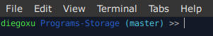

# Terminal de Linux

Personalización de mi terminal. Puedes hacer esto en tu consola de Linux usando el comando `nano ~/.bash_profile` o `nano ~/.bashrc` dependiendo del ambiente que quieres modificar. Con el comando `source ~/.bash_profile` o reiniciando la terminal se activa la configuración nueva.

Para modificar los colores puedes seguir [este tutorial](https://www.lihaoyi.com/post/BuildyourownCommandLinewithANSIescapecodes.html). Para ver una explicación más detallada de lo que está ocurriendo puedes ver [este tutorial](https://linuxhint.com/linux_terminal_customization_guide_beginners/). Te recomiendo hacer la mdificación a mano.

Mi sistema operativo es [Xubuntu 20.04](https://xubuntu.org/news/xubuntu-20-04-released/). Una parte de mi `.bash_profile` se ve así:

```bash
# Comentario al abrir la terminal

echo -e "\033[0;35m ¡Bienvenido, Diego!"

# Aliases

alias uwu="echo 'owo'"
alias profile="nano ~/.bashrc"
alias sprofile="source ~/.bashrc"
alias gita="git add --all"
alias gitc="git commit -m"
alias gitp="git push"
alias gits="git status"
alias gitb="git branch"
alias gith="git checkout"
alias r="ruby"
alias psql="sudo su - postgres"

# Personalización del prompt

parse_branch() {
     git branch 2> /dev/null | sed -e '/^[^*]/d' -e 's/* \(.*\)/ (\1)/'
}

if [ "$color_prompt" = yes ]; then
    PS1='${debian_chroot:+($debian_chroot)}\[\033[01;32m\]\u \[\033[01;34m\]\W\[\033[01;36m\]$(parse_branch) \[\033[00m\]>> '
else
    PS1='${debian_chroot:+($debian_chroot)}\u \W >> '
fi
```

## Prompt personalizado:

El *prompt* consiste en toda la parte previa al input en la terminal del sistema operativo. Indica dónde escribir los comandos y entrega información extra. En mi caso, está el usuario del sistema operativo (verde énfasis). La carpeta donde se ejecuta la terminal (azul énfasis). La branch actual entre paréntesis (cyan énfasis). Y finalmente, el símbolo que indica dónde escribir (sin color). La branch aparece siempre y cuando la carpeta sea un repositorio de Git o esté dentro de uno.

La siguiente ilustración es una captura de pantalla de mi terminal:




## Comandos útiles

| Comando                     | Descripción           																					|
| -------------               |:-------------                                                		|
| `sudo apt update`           | Actualiza la información disponible sobre actualizaciones.			|
| `sudo apt upgrade`          | Efectúa las actualizaciones según la información que se posee.	|
| `sudo dpkg -i programa.deb`	| Instalar un .deb en Ubuntu.																			|
| `code --list-extensions | xargs -L 1 echo code --install-extension` | Imprime en consola un código para instalar las extensiones [VS Code](https://code.visualstudio.com/) instaladas localmente. |