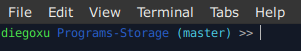

# Linux Terminal

Here is the personalization of my Linux Terminal. You can do it too by running the command `nano ~/.bash_profile` or `nano ~/.bashrc` in the console (depending on which environment you want to modify). With `source ~/.bash_profile` command or restarting the terminal you can activate the new configuration.

To use your own color palette you use [this codes](https://gist.github.com/vratiu/9780109). To see a more detailed explanation you can check [this tutorial](https://linuxhint.com/linux_terminal_customization_guide_beginners/). I recommend you to do this changes by hand, instead of using a software.


My operating system is [Xubuntu 20.04](https://xubuntu.org/news/xubuntu-20-04-released/). A section of my `.bashrc` looks like this:

```bash
# Message printed when starting the terminal

echo -e "\033[0;35m Welcome, Diego!"

# Aliases

alias uwu="echo 'owo'"
alias profile="nano ~/.bashrc"
alias sprofile="source ~/.bashrc"
alias gita="git add --all"
alias gitc="git commit -m"
alias gitp="git push"
alias gits="git status"
alias gitb="git branch"
alias gith="git checkout"
alias r="ruby"
alias psql="sudo su - postgres"


# Prompt personalization

parse_branch() {
     git branch 2> /dev/null | sed -e '/^[^*]/d' -e 's/* \(.*\)/ (\1)/'
}

if [ "$color_prompt" = yes ]; then
    PS1='${debian_chroot:+($debian_chroot)}\[\033[01;32m\]\u \[\033[01;34m\]\W\[\033[01;36m\]$(parse_branch) \[\033[00m\]>> '
else
    PS1='${debian_chroot:+($debian_chroot)}\u \W >> '
fi
```

## Personalized prompt:

The *prompt* consists of all the characters before the input in the operating system terminal. It shows where to write the commands plus some extra information. In my case, I have the actual user of the system (bold green). The folder where the terminal is being executed (bold blue). The actual branch between parenthesis (bold cyan). And finally, the symbol that indicates where to write (without color). The branch appears only if the folder is a Git repository or is within one.

The following ilustration is a screenshot of my terminal:




## Useful commands

| Command                     | Description           																					|
| -------------               | :-------------                                                	|
| `sudo apt update`           | To update the local information about software updates.	       	|
| `sudo apt upgrade`          | To execute the updates according to the local information.      |
| `sudo dpkg -i program.deb`	| To install a .deb in Ubuntu.																		|
| `code --list-extensions | xargs -L 1 echo code --install-extension` | To print a command that installs all the [VS Code](https://code.visualstudio.com/) extensions installed. |